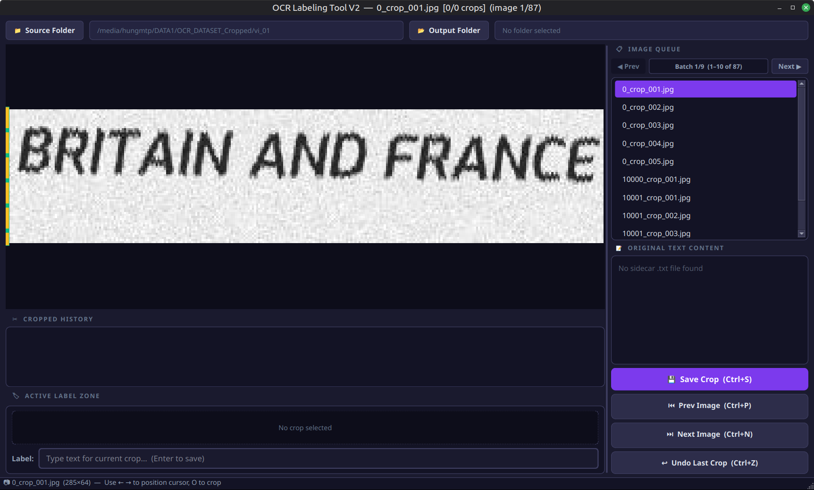

# OCR Data Labeling & Cropping Tool

A desktop GUI application built with **PyQt6** for efficient vertical image cropping and text dataset labeling for OCR training. Optimized for fast, fully keyboard-driven workflows with support for cutting **multiple cropped segments** from a single original image, smart batch loading for large folders (10k+ images), and robust input method editor (IME/fcitx) support.

## Features

- **Multi-crop management** — Cut multiple vertical strips from a single image (e.g., columns, lines of text).
- **Mouse-free Workflow** — Crop starts at X=0 or you can press `I` to open a crop; move cursor with Left/Right Arrows, and press `O` to close a crop. The closed boundary becomes the new open boundary.
- **Smart navigation** — Use Left/Right Arrow keys to move the cursor. Adjust speed using modifiers (`Shift` for 20px, `Ctrl` for 100px).
- **Smart Resume (Output Filtering)** — Automatically scans the Output folder for completed crops, skipping already-processed images from the queue to allow seamless resume upon app restarts.
- **Consolidated label files** — Saves crops to `.jpg` and records all labels in a single `{original_name}_crop.txt` file.
- **IME/Fcitx support** — Robust support for international text input via fcitx.
- **Batch worker thread** — Loads files in batches of 10 for directories containing 10,000+ images without UI lockups.
- **Dark theme** — Modern, eye-friendly dark interface.

## Installation

Ensure you have Python 3.9+ installed.

1. Activate your virtual environment and install dependencies:
```bash
pip install -r requirements.txt
```

## Usage
Quick Run:
```bash
./run.sh
```

Run the tool:
```bash
python main.py
```

### Workflow

1. **Select Source Folder** — Choose the folder containing your source images (`.jpg`, `.png`, etc.).
2. **Select Output Folder** — Choose where cropped images and the consolidated label file will be saved.
3. **Move Cursor**: Use **Left/Right Arrow keys** (or click on the canvas) to place the vertical crop boundary.
4. **Crop**: Press `I` to open a crop and press `O` to cut the vertical segment between the current open boundary and your cursor.
5. **Label**: Focus automatically jumps to the label box. Type your label and press `Enter` to save.
6. **Next Crop**: Focus automatically jumps back to the canvas. The boundary of your last crop is now the starting point. Use Arrow keys to position the cursor for the next crop, then press `O`.
7. **Next Image**: Press `Ctrl+N` to proceed to the next image. Press `Ctrl+P` to go back to the previous image.

### Hotkeys

| Key / Shortcut | Action |
|---|---|
| `Left Arrow` / `Right Arrow` | Move vertical cursor by **3px** |
| `Shift` + `Arrow` | Move vertical cursor by **20px** |
| `Ctrl` + `Arrow` | Move vertical cursor by **100px** |
| `O` | Close current crop (creates segment from open boundary to cursor) |
| `I` | Manually set crop start (open) boundary to cursor's current position |
| `Enter` (inside label box) | Save crop image + write label text |
| `Ctrl+S` | Trigger save for current crop label |
| `Ctrl+Z` (inside label box) | Undo text input typing |
| `Ctrl+Z` (inside canvas) | Undo last crop (deletes crop image & restores open/cursor boundaries) |
| `Ctrl+N` | Go to Next image in queue (auto-advances batches) |
| `Ctrl+P` | Go to Prev image in queue (auto-retreats batches) |
| `Ctrl+Down` | Navigate to next text block |
| `Ctrl+Up` | Navigate to previous text block |
| `Ctrl+B` | Paste current text block into label input |
| `Ctrl+Wheel` | Zoom in/out on canvas |
| `F` | Reset zoom / fit image to canvas view |

### Output Format

For each crop segment saved under an original image `page1.jpg`:
- `{output_folder}/page1_crop_001.jpg` — The cropped image region.
- `{output_folder}/page1_crop.txt` — The consolidated label file listing all crops:
  ```text
  {output_folder}/page1_crop_001.jpg first crop label
  {output_folder}/page1_crop_002.jpg second crop label
  ```

## Requirements

- Python 3.9+
- PyQt6 == 6.4.2
